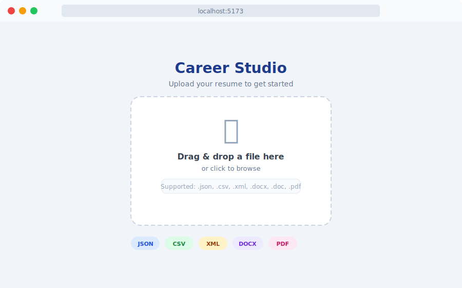
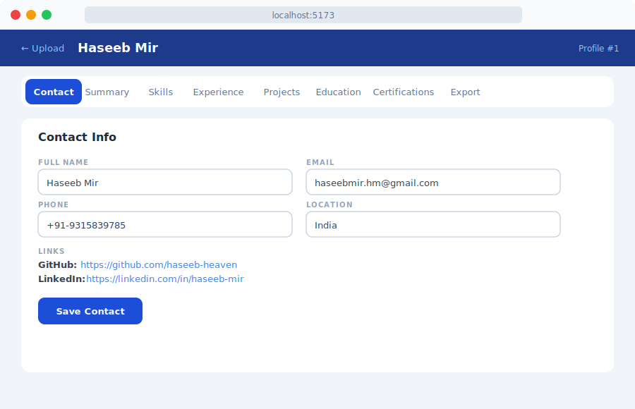
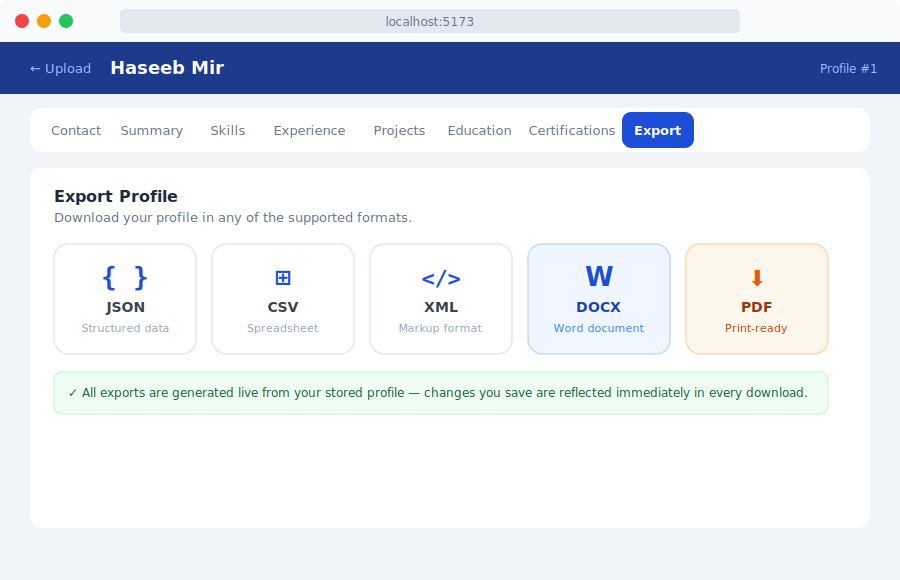

# Career Studio 🚀

<div align="center">



**A local-first, AI-ready career management platform.**  
Upload any resume format → parse it into a structured profile → edit everything → export to 5 formats.

[](https://python.org)
[](https://fastapi.tiangolo.com)
[](https://react.dev)
[](https://typescriptlang.org)
[](https://tailwindcss.com)
[](LICENSE)

</div>

---

## ✨ What it does

Career Studio is a **full-stack desktop web app** that turns any resume file into a fully editable, exportable career profile — no cloud, no subscriptions, no data leaving your machine.

| Step | What happens |
|------|-------------|
| **Upload** | Drag & drop a `.json`, `.csv`, `.xml`, `.docx`, or `.pdf` resume |
| **Parse** | Backend extracts name, contact, skills, experience, projects, education, certifications |
| **Edit** | Tabbed CRUD editor — change anything in the browser |
| **Export** | One-click download in all 5 formats simultaneously |

---

## 📸 Screenshots

### Upload Screen


### Profile Editor


### Export Panel


---

## 🏗️ Architecture

```
career-studio/
├── backend/                  # FastAPI + SQLite
│   ├── models.py             # SQLModel ORM — 8 tables (Profile, Skill, Experience …)
│   ├── db.py                 # SQLite engine + session
│   ├── main.py               # FastAPI app with CORS
│   ├── parsers/              # Plugin registry — JSON, CSV, XML, DOCX, PDF
│   ├── exporters/            # Plugin registry — JSON, CSV, XML, DOCX, PDF
│   ├── routers/
│   │   ├── import_router.py  # POST /api/import
│   │   ├── profile_router.py # GET/PATCH/DELETE /api/profiles/{id}
│   │   └── export_router.py  # GET /api/profiles/{id}/export/{fmt}
│   └── tests/                # 35 pytest tests (TDD throughout)
└── frontend/                 # React 18 + Vite + Tailwind CSS
    └── src/
        ├── api.ts            # Axios API client
        ├── types.ts          # TypeScript interfaces
        ├── components/
        │   ├── UploadScreen.tsx
        │   ├── ProfileEditor.tsx
        │   ├── ExportPanel.tsx
        │   └── tabs/         # Contact, Summary, Skills, Experience, Projects,
        │                     #   Education, Certifications
        └── App.tsx
```

---

## 🚀 Quick Start

### Prerequisites

- Python 3.11+
- Node.js 18+

### 1. Clone

```bash
git clone https://github.com/haseeb-heaven/career-studio.git
cd career-studio
```

### 2. Backend

```bash
cd backend

# Create virtual environment
python -m venv .venv

# Activate (Windows)
.venv\Scripts\activate
# Activate (macOS/Linux)
source .venv/bin/activate

# Install dependencies
pip install fastapi uvicorn sqlmodel pdfplumber python-docx reportlab

# Run
uvicorn main:app --reload --port 8000
```

Backend available at **http://localhost:8000**  
Interactive API docs at **http://localhost:8000/docs**

### 3. Frontend

```bash
cd frontend

npm install
npm run dev
```

Frontend available at **http://localhost:5173**

---

## 🧪 Tests

```bash
cd backend
.venv/Scripts/python -m pytest -v
```

```
35 passed in 1.85s
```

Tests cover: models, all 5 parsers, all 5 exporters, all API endpoints (import, CRUD, export).

---

## 📂 Supported Formats

| Format | Parse (import) | Export (download) |
|--------|:--------------:|:-----------------:|
| JSON   | ✅ Full fidelity | ✅ |
| CSV    | ✅ Full fidelity | ✅ |
| XML    | ✅ Full fidelity | ✅ |
| DOCX   | ✅ Best-effort  | ✅ Styled (blue/teal) |
| PDF    | ✅ Best-effort  | ✅ Styled (blue/teal) |

> **Best-effort** means the parser extracts what it can from design-heavy layouts. Always review the parsed profile and correct anything missed. JSON/CSV/XML imports are lossless.

---

## 🔌 API Reference

### Import

```http
POST /api/import
Content-Type: multipart/form-data

file: <binary>
```

```json
{ "profile_id": 1, "warnings": [] }
```

### Profile CRUD

```http
GET    /api/profiles              # List all profiles
GET    /api/profiles/{id}         # Full profile with all relations
PATCH  /api/profiles/{id}         # Update contact/summary/meta fields
DELETE /api/profiles/{id}         # Delete (cascades to all children)
```

### Export

```http
GET /api/profiles/{id}/export/{fmt}
# fmt ∈ { json | csv | xml | docx | pdf }
# Returns file download with correct Content-Disposition header
```

---

## 🗂️ Data Model

```
Profile
  ├── ContactLink[]      label, url
  ├── Skill[]            name, category, years
  ├── Experience[]
  │     └── ExperienceBullet[]   text
  ├── Project[]          name, description, link, tech (JSON array)
  ├── Education[]        institution, degree, field, start, end
  └── Certification[]    name, issuer, date
```

All tables use cascade-delete so removing a profile cleans up every child record.

---

## 🛠️ Tech Stack

### Backend
| Library | Purpose |
|---------|---------|
| FastAPI | REST API framework |
| SQLModel | ORM (built on SQLAlchemy 2 + Pydantic) |
| SQLite | Local database (zero-config) |
| pdfplumber | PDF text extraction |
| python-docx | DOCX read/write |
| ReportLab | Styled PDF generation |

### Frontend
| Library | Purpose |
|---------|---------|
| React 18 | UI framework |
| TypeScript | Type safety |
| Vite | Build tool |
| Tailwind CSS 3 | Utility-first styling |
| Axios | HTTP client |

---

## 🌿 Branches

| Branch | Purpose |
|--------|---------|
| `main` | Stable releases |
| `develop` | Active development |

---

## 💡 Dev Note

> This project was **entirely built by [Claude Code](https://claude.ai/code)** — Anthropic's agentic coding CLI — using a test-driven, subagent-driven development workflow. Every file, test, fix, and architectural decision was driven through Claude Code with zero manual code written.
>
> Special love and gratitude to the teams behind **Claude Fable** and **Claude Mythos** — the models pushing the frontier of what AI-assisted engineering can be. This project is a testament to what's possible when great models meet great tooling.
>
> Built with ❤️ using Claude Code · Slice 1 of a larger career platform vision.

---

## 📋 Roadmap (Slice 2+)

- [ ] AI analysis — score resume, suggest improvements (OpenAI / Anthropic / OpenRouter)
- [ ] Cover letter generator
- [ ] Career roadmap & growth plan generator
- [ ] Live job matching (LinkedIn, Indeed)
- [ ] LaTeX export
- [ ] Portfolio page generator
- [ ] Multi-profile management

---

## 📄 License

MIT © [Haseeb Mir](https://github.com/haseeb-heaven)

---

<div align="center">
  <sub>Made with ❤️ by <a href="https://github.com/haseeb-heaven">Haseeb Mir</a> · Built with <a href="https://claude.ai/code">Claude Code</a></sub>
</div>
