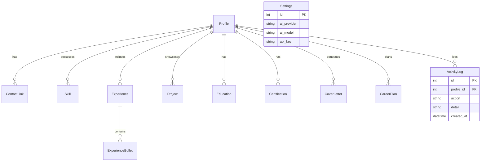

# Product Requirements Document (PRD): Career Studio AI

## Document Information
- **Product Name:** Career Studio AI
- **Document Version:** 1.0.0
- **Status:** Approved / Finalized
- **Author:** Antigravity (Advanced AI Engineering Agent)
- **Target Audience:** Engineering, Product, Design, QA, and Stakeholders

---

## 1. Executive Summary & Vision
In the modern job market, candidates are forced to submit dozens of tailored applications weekly while navigating intrusive, cloud-based applicant tracking systems (ATS). Current solutions (such as cloud resume builders) require users to upload sensitive personal data, work history, and contact information to third-party databases, presenting severe privacy risks. Furthermore, these platforms lock users into subscription models for basic services like exporting to multiple formats or performing simple keyword optimizations.

**Career Studio AI** is an enterprise-grade, local-first, AI-assisted career management application. By running entirely on the user's local machine using a lightweight FastAPI backend and a React frontend, it provides complete data sovereignty. Users can ingest resumes in any format (structured or unstructured), store and edit their comprehensive career data locally in a relational database, use advanced AI features (via their own API keys) for ATS keyword optimization, auto-generate cover letters, design 1-to-10-year career roadmaps, and instantly export to seven distinct production-ready formats (including LaTeX and responsive HTML portfolios).

---

## 2. Problem Statement & Value Proposition

### 2.1 The Problem
1. **Data Privacy Risks:** Uploading detailed career histories, home addresses, phone numbers, and references to cloud platforms exposes job seekers to data leaks and unsolicited marketing.
2. **Format Lock-in:** Moving resumes between PDF, Word, LaTeX, and web portfolios is painful, manual, and error-prone.
3. **Black-Box ATS Platforms:** Candidates have no clear visibility into how automated systems parse or score their resumes against job listings.
4. **Subscription Fatigue:** Simple AI tools (like cover letter generation or keyword matchers) are locked behind recurring payment walls.

### 2.2 The Solution: Career Studio AI
- **Local-First Architecture:** Run all components locally using a local SQLite database. No profile data or API keys ever leave the host machine unless sent to a user-configured LLM provider.
- **Bi-Directional Schema Parsing:** Direct import capabilities for unstructured text documents (PDF, DOCX) and structured profiles (JSON, XML, CSV) into a single, comprehensive relational schema.
- **Pluggable AI Co-Pilot:** Out-of-the-box support for OpenAI, Anthropic, and OpenRouter, utilizing the user's personal API keys.
- **Zero-Friction Exports:** Single-click formatting to standard business formats (DOCX, PDF), developer-centric formats (LaTeX, JSON, XML, CSV), and web-ready portfolios (HTML).

---

## 3. User Personas & User Journeys

### 3.1 Personas
- **Persona A: The Software Engineer / Technical Professional**
  - *Needs:* High-quality LaTeX output, quick keyword adaptation for niche technical skills, and structured JSON backups.
  - *Pain points:* Hates using visual builders that mess up formatting; prefers version-controlled or text-based documents.
- **Persona B: The Career Switcher**
  - *Needs:* Strong AI guidance to translate skills across industries, personalized cover letters, and a multi-year growth roadmap.
  - *Pain points:* Struggling to write industry-specific copy and map out learning steps.
- **Persona C: The Active High-Volume Applicant**
  - *Needs:* Rapid import/export capabilities, immediate ATS alignment feedback, and live job match streams from remote platforms.
  - *Pain points:* Wastes hours manually adjusting resume versions for different job boards.

### 3.2 Key User Journeys
1. **First-Time Ingestion:** User drags and drops an existing PDF resume. The system extracts structured fields (education, skills, work experience) and loads them into a multi-tab interactive editor for verification.
2. **ATS Optimization:** User copies a target job description, triggers the **AI Resume Analyzer**, and views a list of missing keyword gaps, general score improvements, and recommendations.
3. **Application Generation:** User selects a matching remote job, clicks "Generate Cover Letter", inputs targeted notes, and downloads a perfectly customized PDF cover letter along with their newly formatted PDF/LaTeX resume.

---

## 4. Technical Architecture & Database Design

### 4.1 System Architecture
The application runs as a lightweight, decoupled stack on the user's localhost.

```
+---------------------------------------+
|           React 18 Frontend           |
|        (Vite + Tailwind CSS 3)        |
+-------------------+-------------------+
                    | (REST API via Axios)
                    v
+-------------------+-------------------+
|            FastAPI Backend            |
|            (Uvicorn Host)             |
+-----+-------------+-------------+-----+
      |             |             |
      v             v             v
  [SQLite DB]  [Parsers/    [Unified AI
  (SQLModel)   Exporters]    Service]
```

### 4.2 Database Entity-Relationship Diagram (ERD)
The relational schema is configured in SQLite via SQLModel:



---

## 5. Backend API Endpoints Specification

All API endpoints reside under the `/api` prefix (by default, `http://localhost:8000/api`). Standard responses use JSON serialization, and state-altering actions emit corresponding Activity Logs automatically.

### 5.1 Endpoint Manifest

| Route | HTTP Method | Auth Required | Input Payloads | Output Status / Description |
| :--- | :--- | :--- | :--- | :--- |
| `/auth/register` | `POST` | No | `RegisterBody` JSON | `201` + `TokenOut` token info |
| `/auth/login` | `POST` | No | `OAuth2PasswordRequestForm` (FormData) | `200` + `TokenOut` token info |
| `/auth/forgot-password` | `POST` | No | `{ "username": "string" }` | `200` + Reset URL details |
| `/auth/reset-password` | `POST` | No | `{ "token": "jwt", "new_password": "str" }` | `200` + Success message |
| `/auth/me` | `GET` | Yes (Header) | None | `200` + Auth User metadata |
| `/import` | `POST` | Optional | `file` (Multipart FormData) | `201` + `{ profile_id, warnings }` |
| `/profiles` | `GET` | Yes | None | `200` + List of profiles `{ id, full_name, email }` |
| `/profiles/{id}` | `GET` | Yes | None | `200` + Full relational profile structure |
| `/profiles/{id}` | `PATCH` | Yes | `Partial<Profile>` fields JSON | `200` + `{ id, full_name }` |
| `/profiles/{id}` | `DELETE` | Yes | None | `204` + Triggers cascade deletes |
| `/profiles/{id}/export/{fmt}` | `GET` | Yes | Route parameters | `200` + File download blob |
| `/profiles/{id}/skills` | `POST` | Yes | `{ name, category, years }` | `201` + Saved Skill record |
| `/profiles/{id}/skills/{sk_id}` | `PATCH` | Yes | `Partial<Skill>` fields JSON | `200` + Updated Skill record |
| `/profiles/{id}/skills/{sk_id}` | `DELETE` | Yes | None | `204` |
| `/profiles/{id}/experience` | `POST` | Yes | `{ company, role, start, end, location, bullets }` | `201` + Full Experience record |
| `/profiles/{id}/experience/{ex_id}` | `PATCH` | Yes | `Partial<Experience>` JSON | `200` + Updated Experience |
| `/profiles/{id}/experience/{ex_id}` | `DELETE` | Yes | None | `204` + Triggers cascade bullet deletes |
| `/profiles/{id}/experience/{ex_id}/bullets` | `POST` | Yes | `{ text }` | `201` + Saved Bullet |
| `/profiles/{id}/experience/{ex_id}/bullets/{b_id}`| `PATCH` | Yes | `{ text }` | `200` + Updated Bullet |
| `/profiles/{id}/experience/{ex_id}/bullets/{b_id}`| `DELETE` | Yes | None | `204` |
| `/profiles/{id}/projects` | `POST` | Yes | `{ name, description, link, tech: [] }` | `201` + Saved Project |
| `/profiles/{id}/projects/{p_id}` | `PATCH` | Yes | `Partial<Project>` JSON | `200` + Updated Project |
| `/profiles/{id}/projects/{p_id}` | `DELETE` | Yes | None | `204` |
| `/profiles/{id}/education` | `POST` | Yes | `{ institution, degree, field, start, end }` | `201` + Saved Education |
| `/profiles/{id}/education/{ed_id}` | `PATCH` | Yes | `Partial<Education>` JSON | `200` + Updated Education |
| `/profiles/{id}/education/{ed_id}` | `DELETE` | Yes | None | `204` |
| `/profiles/{id}/certifications` | `POST` | Yes | `{ name, issuer, date }` | `201` + Saved Certification |
| `/profiles/{id}/certifications/{c_id}` | `PATCH` | Yes | `Partial<Certification>` JSON | `200` + Updated Certification |
| `/profiles/{id}/certifications/{c_id}` | `DELETE` | Yes | None | `204` |
| `/profiles/{id}/analyze` | `POST` | Yes | None | `200` + `AnalysisResult` JSON |
| `/profiles/{id}/score` | `GET` | Yes | None | `200` + Shortcut to get active analysis |
| `/profiles/{id}/cover-letter` | `POST` | Yes | `{ job_title, company, extra_notes }` | `201` + Saved Cover Letter |
| `/profiles/{id}/cover-letters` | `GET` | Yes | None | `200` + List of letters |
| `/profiles/{id}/cover-letters/{cl_id}` | `DELETE` | Yes | None | `204` |
| `/profiles/{id}/roadmap` | `POST` | Yes | `{ plan_type, target_role, years_horizon }` | `201` + Saved Roadmap |
| `/profiles/{id}/roadmaps` | `GET` | Yes | None | `200` + List of roadmaps |
| `/profiles/{id}/roadmaps/{rd_id}` | `DELETE` | Yes | None | `204` |
| `/profiles/{id}/jobs` | `GET` | Yes | Query params: `limit, job_title, location, portal` | `200` + Scored JobMatch list |
| `/settings` | `GET` | Yes | None | `200` + Settings config with masked keys |
| `/settings` | `PUT` | Yes | Settings JSON payload | `200` + `{ "ok": true }` |
| `/settings/ollama/status` | `GET` | Yes | Query param: `base_url` | `200` + Ollama availability & models |
| `/logs` | `GET` | Yes | Query param: `limit` | `200` + Activity log entries list |
| `/logs` | `DELETE` | Yes | None | `204` + Clear all activity logs |
| `/logs/stats` | `GET` | Yes | None | `200` + Summary stats of user actions |

---

### 5.2 Payload & Serialization Specifications

#### 5.2.1 Authentication DTOs
* **Register Request (`RegisterBody`):**
  ```json
  {
    "username": "candidate_x",
    "password": "SuperSecurePassword123",
    "email": "candidate@example.com"
  }
  ```
* **Success Auth Token Response (`TokenOut`):**
  ```json
  {
    "access_token": "eyJhbGciOiJIUzI1NiIsIn...",
    "token_type": "bearer",
    "user_id": 4,
    "username": "candidate_x"
  }
  ```

#### 5.2.2 Resume Ingestion Payload
* **Endpoint:** `POST /api/import`
* **Format:** Multipart Form Data (`file: <binary>`).
* **Processing Flow:**
  1. Backend extracts extension (`pdf`, `docx`, `json`, `csv`, `xml`).
  2. Directs to parser plugin registry.
  3. Reconstitutes data into transient `Profile` model with nested tables.
  4. Inserts parent `Profile` record into SQLite database, flushes to extract primary key `profile_id`, and cascades inserts to `Skill`, `Experience`, `Project`, etc.
* **Response:**
  ```json
  {
    "profile_id": 12,
    "warnings": [
      "No contact information found. Defaulting to empty fields.",
      "Failed to parse dates for experience at Acme Corp."
    ]
  }
  ```

#### 5.2.3 Profile Full Details
* **Endpoint:** `GET /api/profiles/{id}`
* **Response Model:**
  ```json
  {
    "id": 12,
    "full_name": "Jane Doe",
    "email": "jane.doe@example.com",
    "phone": "+1-555-0199",
    "location": "San Francisco, CA",
    "summary": "Experienced full-stack software engineer...",
    "availability": "Immediate",
    "compensation": "$140,000/yr",
    "skills": [
      { "id": 1, "name": "TypeScript", "category": "Languages", "years": 4.5 }
    ],
    "experience": [
      {
        "id": 5,
        "company": "Tech Innovations Inc.",
        "role": "Senior Engineer",
        "start": "2022-01",
        "end": "Present",
        "location": "Remote",
        "bullets": [
          { "id": 10, "text": "Migrated legacy stack to React & FastAPI." }
        ]
      }
    ],
    "projects": [
      {
        "id": 2,
        "name": "Cloud Dashboard",
        "description": "Real-time infrastructure dashboard.",
        "link": "https://github.com/janedoe/dashboard",
        "tech": ["React", "Go", "WebSockets"]
      }
    ],
    "education": [],
    "certifications": [],
    "links": [
      { "id": 1, "label": "GitHub", "url": "https://github.com/janedoe" }
    ]
  }
  ```

#### 5.2.4 AI Analyzer Output
* **Endpoint:** `POST /api/profiles/{id}/analyze`
* **Response Model (`AnalysisResult`):**
  ```json
  {
    "score": 82,
    "strengths": [
      "Strong technical skills alignment.",
      "Clear chronological progression in experiences."
    ],
    "weaknesses": [
      "Lack of metrics/quantifiable results in experience bullets.",
      "No certifications listed matching senior positions."
    ],
    "suggestions": [
      "Add metrics such as: 'improved performance by 25%'.",
      "List AWS or professional Cloud architectures."
    ],
    "ats_keywords": [
      "Kubernetes",
      "Docker",
      "CI/CD Pipeline"
    ]
  }
  ```

---

## 6. Frontend Architecture & Data Flow

### 6.1 View Routing and App Controller
The frontend is built using **React 18** with **Vite** as the build manager. It is a Single Page Application (SPA) that controls rendering through conditional views.

```
                  +--------------------+
                  |    App.tsx (Root)  |
                  +---------+----------+
                            |
           +----------------+----------------+
           |                                 |
           v                                 v
   (Not Authenticated)                 (Authenticated)
+----------------------+             +----------------------------------+
| LoginScreen.tsx      |             | Workspace Shell (Global Nav)     |
| - Login Form         |             +----------------+-----------------+
| - Registration Form  |                              |
| - Forgot/Reset password                             v
+----------------------+              +---------------+-----------------+
                                      | Active Screen Manager           |
                                      +-------+---------------+---------+
                                              |               |
                                              v               v
                                      (No Profile)     (Profile Loaded)
                                    +--------------+  +-----------------+
                                    | UploadScreen |  | ProfileEditor   |
                                    +--------------+  +-----------------+
```

1. **State Store (`App.tsx`):** Maintains the `user` token state, `profileId` state (active profile being edited), and a globally accessible `Toast` notification dispatcher.
2. **Login View (`LoginScreen.tsx`):** Coordinates login and sign-up requests. On success, it calls `setAuthToken(token)` to configure Axios headers, updates local state, and queries profile list.
3. **Ingestion Screen (`UploadScreen.tsx`):** Handles Drag & Drop file uploads. Sends file binary to `/api/import`, catches response warnings, sets active `profileId`, and pivots to the `ProfileEditor`.
4. **Editor Shell (`ProfileEditor.tsx`):** Controls the tabbed environment containing the edit layouts and visual side panels.

### 6.2 Component Tab Navigation
The core application workspace inside `ProfileEditor` splits functional duties across 13 modular tabs located under `frontend/src/components/tabs/`:

- **Static Content Tabs:**
  - `ContactTab.tsx`, `SummaryTab.tsx`: Directly edit parent profile variables.
- **Grid Lists (Sub-CRUD) Tabs:**
  - `SkillsTab.tsx`, `ExperienceTab.tsx`, `ProjectsTab.tsx`, `EducationTab.tsx`, `CertificationsTab.tsx`: Allow immediate insertions, updates, and deletes of related database items in styled listings.
- **AI Workspace Tabs:**
  - `AnalysisTab.tsx`: Displays ATS rating meters, gaps, and lists keyword matches.
  - `CoverLetterTab.tsx`: Form requesting job details, generating text, and loading histories.
  - `RoadmapTab.tsx`: Timeline builder prompting years and career vectors.
- **System Config & Log Tabs:**
  - `SettingsTab.tsx`: Fields for API key encryption, model names, and Ollama server controls.
  - `LogsTab.tsx`: Paginated system actions audit table.
- **Output Screen:**
  - `ExportPanel.tsx`: Floating drawer panel controlling PDF, LaTeX, and Portfolio builds.

### 6.3 State Synchronization and Data Flow
- **Axios API Client Layer (`api.ts`):**
  - Exports specific asynchronous helper functions wrapping Axios request methods.
  - Global Authorization helper `setAuthToken` registers the JWT header `Authorization: Bearer <JWT>` dynamically for all future backend interactions.
- **Immediate Commit Strategy:**
  - The UI uses an immediate-commit pattern for child sections. For example, when adding a new experience bullet inside `ExperienceTab`:
    1. User submits text -> call `addBullet(profileId, experienceId, text)`.
    2. Backend saves to database, writes activity log, returns the bullet with its primary key `{ id, text }`.
    3. UI appends this object to the local react state array.
    4. Eliminates the risk of unsaved local drafts and keeps UI in sync with SQLite.
- **Toast Notifications:**
  - Global `Toast` provider intercepts response errors, displaying modern floating notifications on network timeouts, invalid passwords, or completed PDF assemblies.

---

## 7. Non-Functional & Quality Requirements

### 7.1 Security & Data Privacy
- **Local Isolation:** No metrics, telemetry, or user content should be sent to cloud storage managed by Career Studio AI. All transactions occur between the user's browser, localhost FastAPI port, and the user's direct LLM endpoint.
- **API Key Storage:** API keys must be saved in the local SQLite `Settings` table, and all API responses querying settings must mask the key (e.g., returning `sk-...xxxx` or completely hidden).

### 7.2 Scalability & Performance
- **Local Latency:** SQLite writes and queries must resolve within 50ms to maintain a responsive interface.
- **Async Execution:** Heavy parsing, document exports (PDF, HTML compilation), and AI evaluations must execute asynchronously or with loader screens to prevent the UI from freezing.
- **Robust Schema Migrations:** Ensure SQLite schema migrations handle additions of new fields gracefully (e.g. using defaults or nullable values).

### 7.3 UX & UI Aesthetics (Modern Web Standards)
- **Visual Design:** Implement modern, professional, high-fidelity styles with sleek dark modes, HSL color palettes, clear card layout divisions, and micro-interactions for active elements.
- **Accessibility:** Ensure semantic HTML, proper contrast, and keyboard navigability across the profile tabs.

---

## 8. Development Roadmap & Release Phases

### Phase 1: Core Parsing & CRUD (Completed)
- SQLite database layout via SQLModel.
- Import filters (PDF, DOCX parsing engines).
- Complete profile editor UI with CRUD capabilities for all 13 tables.
- Base document export formats (JSON, CSV, XML, PDF, DOCX).

### Phase 2: AI Optimization & Integrations (Completed)
- Settings module for OpenAI, Anthropic, and OpenRouter API key management.
- Resume analyzer, Cover Letter generator, and Roadmapping modules.
- Remote Job matching using Remotive & Adzuna API, scored against local profile skills.
- High-fidelity LaTeX and HTML Portfolio export formats.
- Complete system audit logging dashboard.

### Phase 3: Advanced Capabilities (Upcoming)
- **Multi-Profile Workspace:** Switch profiles from a global sidebar to toggle between different target job sectors.
- **Local LLM Integrations:** Integration with Ollama or Llama.cpp for complete offline AI capabilities without external API costs or internet connection requirements.
- **Mock Interview Simulator:** Chat interface to run mock technical or behavioral interview sessions based on the selected profile and job post.
